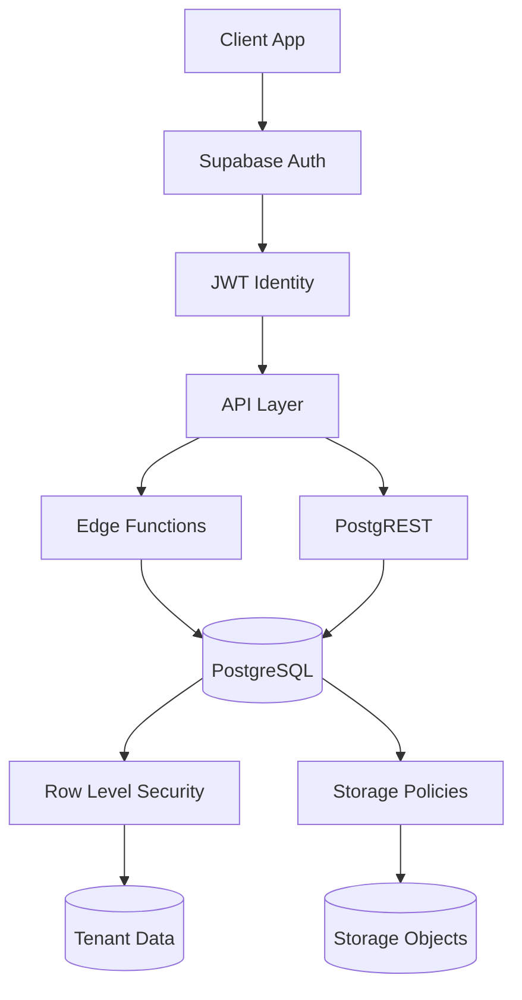

# Supabase Security Labs


A collection of reproducible security labs for understanding how Supabase authorization failures occur in real systems.

Small, reproducible labs for reviewing common Supabase security mistakes, tenant-isolation failures, and debugging workflows.

This repository is designed as a **security learning project**, **debugging reference**, and **portfolio showcase** for Supabase backend security work.

---

## Table of Contents

- [Supabase Security Architecture](#supabase-security-architecture-simplified)
- [Threat Model](#threat-model)
- [Security Labs Overview](#security-labs-overview)
- [Repository Guide](#repository-guide)
- [Labs](#labs)
- [Architecture Documentation](#architecture-notes)
- [Security Review Focus](#security-review-focus)
- [Security Research Focus](#security-research-focus)
- [Project Notes](#project-notes)
- [Author](#author)

---

## Learning Goals

This repository was created to explore how authorization failures occur in Supabase-based applications and how they can be systematically diagnosed and fixed.

The project focuses on developing a deeper understanding of:

- Row Level Security (RLS) behavior in PostgreSQL
- multi-tenant isolation patterns
- authorization context propagation through Edge Functions
- common Supabase security misconfigurations
- practical debugging workflows for backend systems

Each lab isolates a specific failure scenario and demonstrates how the issue can be reproduced, analyzed and corrected.

The goal is not only to understand correct patterns, but also to study how real systems fail when those patterns are misapplied.

---

## Project Status

This repository is an active learning and research project focused on Supabase backend security.

New labs and documentation may be added over time as additional security scenarios and debugging patterns are explored.

The goal is to gradually build a small collection of reproducible examples demonstrating how Supabase authorization failures occur and how they can be diagnosed and fixed.

---

## Supabase Security Architecture (Simplified)



---

## Threat Model

The labs in this repository assume a typical multi-tenant Supabase application.

The primary security goal is **tenant isolation**.

The system must guarantee that:

- users can only access data belonging to their tenant
- storage objects cannot be accessed across tenants
- Edge Functions cannot bypass authorization rules
- RLS policies are always evaluated with the correct user identity

### Trust Boundaries

The architecture contains several trust boundaries:

Client → API  
API → Database  
Database → Storage

Each boundary introduces potential authorization failures.

### Primary Risks

Common security risks in Supabase applications include:

- incorrect RLS policy design
- using `service_role` in user-facing Edge Functions
- missing JWT forwarding
- incomplete tenant membership checks
- insecure signed URL generation
- debug policies left enabled

The labs demonstrate how these risks appear in real systems and how they can be detected and fixed.

---

## Security Labs Overview

| Lab | Topic | Key Lesson |
|----|----|----|
| RLS Broken Lab | Row Level Security mistakes | Small policy errors can break tenant isolation |
| Edge Service Role Lab | service_role misuse | service_role bypasses RLS entirely |
| Storage Security Lab | Storage policies | Storage access must validate tenant membership |

---

## Repository Guide

This repository can be explored in three ways depending on what you are looking for.

### 1. Security Concepts

Architecture and security design documentation.

- Multi-Tenant Isolation  
  `docs/multi-tenant-isolation.md`

- Request Pipeline  
  `docs/request-pipeline.md`

- Security Layers  
  `docs/security-layers.md`

- RLS Evaluation Order  
  `docs/rls-evaluation-order.md`

---

### 2. Security Labs

Reproducible labs demonstrating common Supabase security failures.

- RLS Broken Lab  
  `rls-broken-lab/`

- Edge Service Role Lab  
  `edge-service-role-lab/`

- Storage Security Lab  
  `storage-security-lab/`

---

### 3. Security Review Perspective

Documents showing how these issues appear during real security reviews.

- Security Scenarios  
  `SECURITY-SCENARIOS.md`

- Security Review Example  
  `SECURITY-REVIEW-EXAMPLE.md`

- Security Audit Checklist  
  `docs/supabase-security-audit-checklist.md`

---

## What this repository demonstrates

This project focuses on practical Supabase security topics that frequently appear in real applications:

- Row Level Security (RLS)
- multi-tenant data isolation
- membership-based access control
- Supabase Storage security
- Edge Function auth context handling
- `service_role` misuse
- debugging and verification workflows

Instead of presenting only theory, the labs show how security issues appear in practice, how to reproduce them, and how to verify the fix.

---

## Why these labs exist

Supabase applications often look correct at first glance but still fail under security review.

Common examples include:

- policies that accidentally return empty result sets
- policies that compare the wrong identity values
- temporary debug policies left enabled
- Edge Functions that bypass RLS
- storage paths that do not properly enforce tenant boundaries
- signed URL flows that leak access through insecure server-side logic

These labs were built to make those mistakes visible, testable, and easier to explain.

---

## Repository structure

```text
SUPABASE-SECURITY-LABS
│
├── docs
│   ├── multi-tenant-isolation.md
│   ├── request-pipeline.md
│   ├── security-layers.md
│   └── rls-evaluation-order.md
│
├── schema
│   ├── family-core.sql
│   └── README.md
│
├── rls-broken-lab
│   ├── diagrams
│   ├── docs
│   ├── scripts
│   └── supabase
│
├── edge-service-role-lab
│   ├── diagrams
│   ├── docs
│   ├── scripts
│   └── supabase
│
└── storage-security-lab
    ├── docs
    ├── scripts
    └── supabase
```

## Shared data model

The labs use a simplified family-based multi-tenant model.

Core entities:

+ users
+ profiles
+ families
+ family_members
+ posts
+ family_photos

Conceptually:

```text
user
  ↓
family_members
  ↓
family
  ↓
posts / storage objects
```

Tenant isolation is enforced through:

+ Supabase Auth identity
+ auth.uid()
+ membership tables
+ RLS policies
+ storage access checks

## Labs

## 1) RLS Broken Lab

Demonstrates common Row Level Security mistakes.

Topics covered:

+ missing SELECT policies
+ incorrect identity comparison (profile_id vs auth.uid())
+ temporary debug policies left enabled
+ cross-tenant leaks
+ safe policy repair patterns

This lab shows that even small policy mistakes can lead to:

+ unexpected empty results
+ incorrect authorization behavior
+ data exposure across tenants

## 2) Edge Service Role Lab

Demonstrates how service_role bypasses RLS.

Scenario:

An Edge Function creates a Supabase client using the service_role key and performs database reads without preserving the user auth context.

Result:

+ PostgreSQL does not evaluate RLS in the expected user context
+ rows from other tenants can be returned
+ the function appears to work while silently breaking tenant isolation

Fix:

Use:

+ anon key
+ forwarded user JWT

This preserves the caller identity and allows PostgreSQL + RLS to enforce tenant boundaries correctly.

## 3) Storage Security Lab

Demonstrates secure file access patterns in Supabase Storage.

Topics covered:

+ private bucket design
+ tenant-scoped path structure
+ membership-based storage policies
+ signed URL leak scenarios through insecure Edge logic

Example object path:

```text
<family_id>/photo.jpg
```

This lab emphasizes that storage security depends on both:

+ correct policy rules
+ correct object path design

## Architecture notes

The docs/ directory includes architecture and security reference material for the labs.

## Multi-Tenant Isolation

Explains how tenant boundaries are enforced through:

+ JWT identity
+ membership checks
+ RLS policies

## Request Pipeline

Illustrates the request flow:

```text
Client
→ Auth
→ JWT
→ PostgREST / Edge
→ PostgreSQL
→ RLS
```

## Security Layers

Documents layered protection across:

1. authentication
2. identity propagation
3. API layer
4. database authorization
5. storage policies

## RLS Evaluation Order

Explains how PostgreSQL evaluates access rules:

1. identify target table
2. check whether RLS is enabled
3. collect applicable policies
4. evaluate USING
5. evaluate WITH CHECK

## Reproducibility

Each lab is intentionally small and reproducible.

The included scripts are used to:

+ seed sample data
+ log in test users
+ call vulnerable flows
+ verify cross-tenant behavior
+ validate the fix

This makes the repository useful not only as documentation, but also as a debugging and review environment.

## Key security lessons

+ RLS is the primary tenant isolation mechanism
+ service_role bypasses RLS completely
+ Edge Functions must preserve user auth context
+ Storage security depends on both policy logic and path design
+ temporary debug shortcuts can become production leaks
+ security review must validate behavior, not just configuration

## Who this repository is for

This project may be useful for:

- developers learning Supabase security fundamentals
- teams reviewing multi-tenant backend architecture
- founders building SaaS applications on Supabase
- engineers debugging RLS and authorization-context issues
- clients who need a focused security review of an existing Supabase backend

## Example review areas

A security review based on the same principles typically includes:

+ RLS policy review
+ multi-tenant isolation checks
+ Edge Function auth-context review
+ service-role usage review
+ Storage bucket and policy review
+ signed URL flow review
+ debugging of access-denied vs data-leak scenarios

## Positioning

This repository is intentionally lightweight.

It is not a full production application.

It is a compact set of labs created to demonstrate:

+ security reasoning
+ debugging discipline
+ reproducible verification
+ practical understanding of how Supabase authorization actually fails in real systems

## Development approach

This project was developed locally using:

+ Supabase CLI
+ Docker
+ PostgreSQL migrations
+ Edge Functions
+ shell test scripts
+ Mermaid diagrams

The emphasis is on clarity, reproducibility, and explainable security behavior.

## + Planned additions

Possible future additions:

+ Supabase security audit checklist
+ RLS debugging checklist
+ freelance incident-style review scenarios
+ rate limiting examples
+ input validation examples
+ API abuse scenarios

## Freelance focus

This repository supports a practical freelance service direction around:

**Supabase RLS & Edge Security Review**

Typical outcomes of that review include:

+ identification of tenant-isolation risks
+ analysis of RLS policy gaps
+ review of Edge Function auth handling
+ storage security findings
+ prioritized remediation recommendations
+ debugging guidance for real access-control issues

## Security Review Focus

Typical Supabase security reviews focus on:

- RLS policy correctness
- tenant isolation verification
- Edge Function authorization context
- service_role usage
- storage access control
- signed URL flows
- debugging authorization failures

The labs in this repository illustrate common failure patterns and debugging strategies used during such reviews.

## Security Research Focus

This repository explores real-world Supabase authorization failures and debugging techniques.

Topics include:

- RLS policy design errors
- service_role misuse
- Edge Function authorization context
- multi-tenant isolation failures
- storage access control mistakes

Each lab demonstrates how these issues appear in practice and how they can be diagnosed and fixed.

## Project Notes

This repository was developed as part of a structured self-learning process focused on:

- Supabase security
- multi-tenant backend architecture
- Row Level Security (RLS)
- practical security debugging workflows

The goal of the project is to better understand how authorization failures occur in Supabase-based systems and how they can be reproduced, analyzed and fixed.

This repository may serve as:

- a learning reference
- a reproducible security lab environment
- a Supabase security review showcase
- a portfolio example for backend and security-focused work

## Author

This repository is maintained as part of an ongoing exploration of Supabase backend architecture and security patterns.

Related repository:

- **supabase-patterns**  
  Supabase backend architecture patterns including Edge → RPC workflows, RLS patterns and security review checklists.
