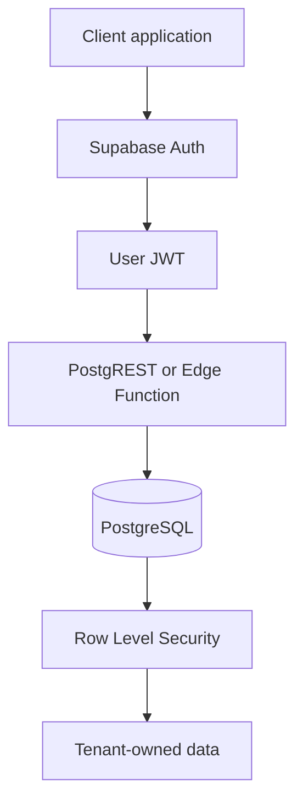

# Supabase Security Labs

Documented security case studies showing how authorization failures appear in Supabase applications, how to trace their root cause, and how to design a safer fix.

The examples focus on a family-based multi-tenant model. Each family is a tenant, and users must never read rows or Storage objects belonging to another family.

## What this project demonstrates

- diagnosing empty results and cross-tenant access caused by incorrect RLS policies
- preserving the caller's JWT through an Edge Function so PostgreSQL can enforce RLS
- recognizing when `service_role` silently removes the database authorization boundary
- designing private Storage paths and policies around tenant membership
- writing security findings with impact, root cause, and remediation

This is a technical case-study repository, not a production application or automated security scanner. Intentionally vulnerable code is isolated inside clearly named lab folders and must only be used in a disposable local or test project.

## Case studies

| Lab | Failure demonstrated | Evidence included | Status |
| --- | --- | --- | --- |
| [RLS Broken Lab](rls-broken-lab/) | Incorrect identity checks and permissive policies expose rows across tenants | staged SQL migrations, two-tenant seed script, request scripts, diagrams | Documented staged lab |
| [Edge Service Role Lab](edge-service-role-lab/) | A user-facing Edge Function queries with `service_role` and bypasses RLS | vulnerable and corrected functions, migration, request script, diagram | Runnable components |
| [Storage Security Lab](storage-security-lab/) | Incorrect path or signed-URL authorization can expose another tenant's files | Storage policies, two-tenant test script, scenario notes | Policy lab; signed-URL case is documentation-only |

## Central security model

```mermaid
flowchart TD
  Client[Client application] --> Auth[Supabase Auth]
  Auth --> JWT[User JWT]
  JWT --> API[PostgREST or Edge Function]
  API --> DB[(PostgreSQL)]
  DB --> RLS[Row Level Security]
  RLS --> Tenant[Tenant-owned data]
```

Authentication identifies the caller. RLS decides which rows that caller may access. An Edge Function that replaces the caller context with `service_role` bypasses that protection and must enforce authorization itself.

## Repository guide

### Practical labs

- [`rls-broken-lab/`](rls-broken-lab/) compares intentionally unsafe policies with their corrected form.
- [`edge-service-role-lab/`](edge-service-role-lab/) places vulnerable and secure Edge Functions side by side.
- [`storage-security-lab/`](storage-security-lab/) demonstrates tenant-scoped Storage paths and membership policies.

### Review material

- [`SECURITY-REVIEW-EXAMPLE.md`](SECURITY-REVIEW-EXAMPLE.md) shows how findings are reported.
- [`SECURITY-SCENARIOS.md`](SECURITY-SCENARIOS.md) describes three common authorization failures.
- [`docs/supabase-security-audit-checklist.md`](docs/supabase-security-audit-checklist.md) provides a structured review checklist.
- [`docs/supabase-security-review.md`](docs/supabase-security-review.md) explains the review approach.

### Architecture notes

- [`docs/multi-tenant-isolation.md`](docs/multi-tenant-isolation.md)
- [`docs/request-pipeline.md`](docs/request-pipeline.md)
- [`docs/rls-evaluation-order.md`](docs/rls-evaluation-order.md)
- [`docs/security-layers.md`](docs/security-layers.md)
- [`docs/session-context.md`](docs/session-context.md)

The shared reference model is documented in [`schema/`](schema/). Individual labs intentionally use smaller variations of that model.

## How to review the labs

Start with the RLS lab if the symptom is an empty result set or unexpected row access. Start with the Edge lab if authentication succeeds but an endpoint returns data outside the caller's tenant. Use the Storage lab when database rows are protected but file access is not.

The RLS lab contains separate schema, broken-policy, and fixed-policy SQL files. They represent stages of one investigation. Applying every migration in sequence produces the final fixed state; it does not preserve the intentionally vulnerable midpoint. See the lab README before applying any SQL.

The shell scripts use test credentials and are intended for disposable environments. Do not point them at a production project.

## Example review output

A finding in [`SECURITY-REVIEW-EXAMPLE.md`](SECURITY-REVIEW-EXAMPLE.md) records:

1. severity and affected authorization boundary
2. observable impact
3. root cause
4. recommended remediation
5. the behavior that should be verified after the fix

This keeps the review tied to behavior rather than treating “RLS enabled” as proof that data is isolated.

## Security lessons

- RLS must be tested with at least two tenant identities.
- `USING` controls which existing rows are visible to an operation.
- `WITH CHECK` controls which row state may be created or retained.
- permissive debug policies can override otherwise restrictive-looking policy sets.
- `service_role` is appropriate only in trusted server-side flows with explicit authorization.
- private buckets do not make signed-URL generation safe by themselves.
- a successful request is not sufficient evidence; tests must inspect which tenant's data was returned.

## Limitations

- The repository documents controlled examples; it is not a substitute for reviewing a real project's schema, grants, functions, and request paths.
- Some labs contain runnable components rather than a single-command harness.
- The signed-URL scenario is currently documented but does not include a complete deployable Edge Function.
- Vulnerable examples are intentionally unsafe and must never be deployed to a production project.

## Related project

[`supabase-patterns`](https://github.com/elamilutinovic-vibePep/supabase-patterns) contains small backend patterns for RLS-first ownership, controlled RPC entry points, and Edge-to-RPC separation of concerns.

## Author

Maintained by [Ela Milutinovic](https://github.com/elamilutinovic-vibePep) as part of [VibePep](https://vibepep.com/), with a focus on Supabase authorization, RLS debugging, and backend security reviews.