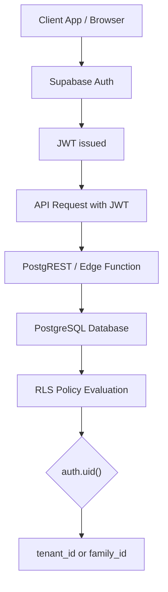

# Supabase Multi-Tenant Isolation Model

This diagram explains how Supabase enforces tenant isolation in multi-tenant applications using JWT identity and PostgreSQL Row Level Security.

## Explanation

Supabase enforces multi-tenant isolation primarily through **PostgreSQL Row Level Security (RLS)**.

Each request follows this flow:

1. User authenticates through Supabase Auth

2. Supabase issues a JWT token

3. Client sends requests with the JWT

4. PostgREST or Edge Functions forward the request to PostgreSQL

5. PostgreSQL evaluates RLS policies

6. Policies use auth.uid() to identify the user

7. Database filters rows based on tenant membership (family, organization, etc.)

The database only returns rows that pass the policy.

## Typical Multi-Tenant Pattern

Example schema:

> users
> 
> families
> 
> family_members
> 
> posts

Relationship:

> user
> 
>   ↓
> 
> family_members
> 
>   ↓
> 
> family
> 
>   ↓
> 
> posts

Example RLS policy:

        USING (
        EXISTS (
            SELECT 1
            FROM family_members fm
            WHERE fm.family_id = posts.family_id
            AND fm.user_id = auth.uid()
        )
        )

This ensures a user can only access rows belonging to families they are part of.

## Important Security Properties
### Isolation happens in the database

Even if an API bug occurs, PostgreSQL will still enforce RLS.

### JWT carries the identity

Policies rely on:

> auth.uid()

which comes from the JWT.

### Service Role bypasses RLS

If an Edge Function uses:

> service_role

RLS is completely bypassed.

This is the most common Supabase security mistake.

## Key Idea

Supabase multi-tenant security is achieved by combining:

+ JWT identity

+ PostgreSQL RLS

+ tenant membership tables

+ strict API design

If implemented correctly, the database itself guarantees tenant isolation.