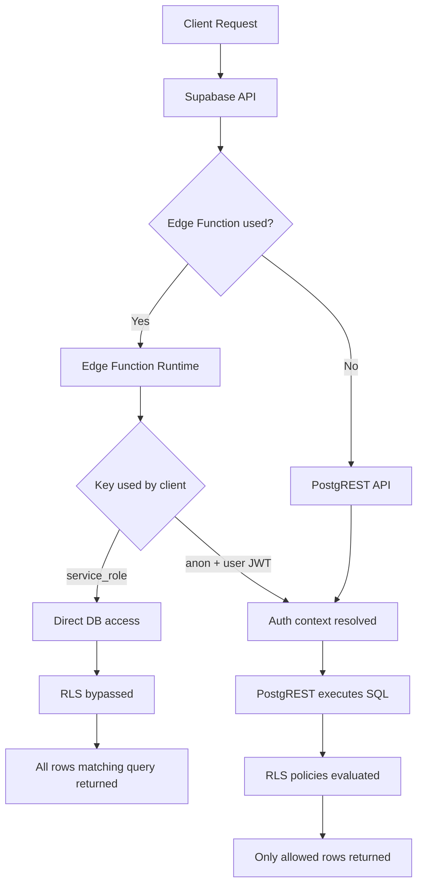

# Supabase Request Pipeline

This diagram shows where authentication and RLS are evaluated in the Supabase request flow.

## Explanation
### Step 1 — Client request

A client calls Supabase via:

+ REST API

+ Edge Function

+ Supabase client SDK

### Step 2 — Authentication context

If the request contains a user JWT:

> auth.uid()

is resolved.

Without JWT:

> auth.uid() = NULL

### Step 3 — PostgREST executes query

Supabase internally uses PostgREST to run database queries.

### Step 4 — RLS evaluation

Before returning rows PostgreSQL evaluates:

> RLS policies

based on:

+ auth.uid()

+ role

+ policy conditions

### Important exception

If a request is executed using:

> service_role

then:

+ RLS is bypassed

+ full database access is granted

This is why service_role must never be used for user-facing queries.