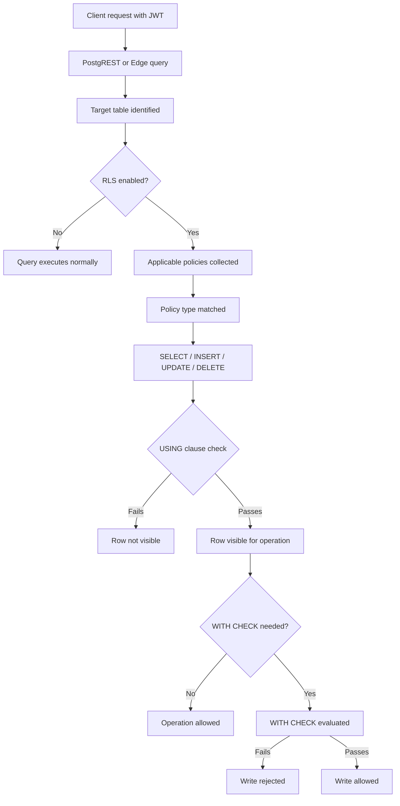

# Supabase RLS Evaluation Order

This diagram shows the logical order in which PostgreSQL evaluates access when Row Level Security is enabled.

## Explanation

When PostgreSQL evaluates a request against a table protected by RLS, it does not simply run the SQL query as-is.

Instead, it checks access in this order:

## 1. Identify the target table

The database first determines which table the request is trying to access.

## 2. Check whether RLS is enabled

If RLS is not enabled, PostgreSQL executes the query normally.

If RLS is enabled, PostgreSQL continues with policy evaluation.

## 3. Collect matching policies

The database selects policies relevant for:

+ the current role

+ the current operation

+ the target table

## 4. Evaluate the `USING` clause

For `SELECT`, `UPDATE`, and `DELETE`, PostgreSQL checks whether each row satisfies the `USING` condition.

If a row does not satisfy `USING`, that row is invisible for the operation.

## 5. Evaluate the `WITH CHECK` clause

For `INSERT` and `UPDATE`, PostgreSQL also checks whether the new row values satisfy `WITH CHECK`.

If `WITH CHECK` fails, the write is rejected even if the row was visible.

## Important Rule
`USING`

Controls which existing rows are visible or targetable.

`WITH CHECK`

Controls which new or modified row values are allowed.

## Typical confusion

A common bug is:

> USING (user_id = auth.uid())

without:

> WITH CHECK (user_id = auth.uid())

This may allow a write path to behave unexpectedly.

## Key Idea

If RLS seems “broken,” the first debugging question is:

+ Did the row fail USING?

+ Or did the write fail WITH CHECK?