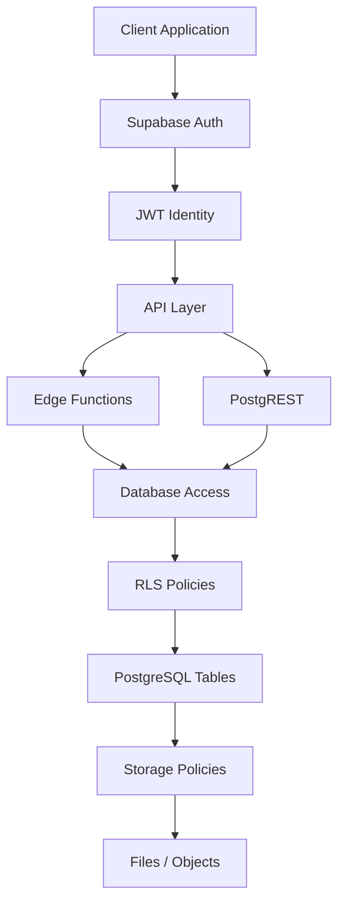

# Supabase Security Layers

## Security Layers

Supabase enforces security through multiple layers.

## 1. Authentication

Handled by **Supabase Auth**.

Users receive a JWT.

## 2. Identity Context

The JWT contains:

> auth.uid()

This identifies the user in policies.

## 3. API Layer

Requests go through:

+ PostgREST

+ Edge Functions

## 4. Row Level Security

PostgreSQL enforces:

> RLS policies

This controls row access.

## 5. Storage Policies

Storage buckets apply additional policies for file access.

## Key Principle

Security is enforced in the database layer.

Even if an API bug occurs, RLS still protects tenant data.