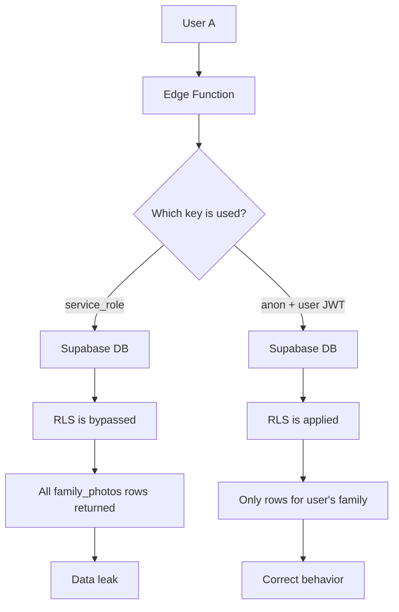

# Service Role Bypass Diagram

## Key point

`service_role` bypasses RLS completely.

If an Edge Function uses `service_role` for user-facing queries,
the database will return rows outside the user's tenant boundary
unless ownership is manually enforced.

Using `anon` + forwarded user JWT keeps RLS active.