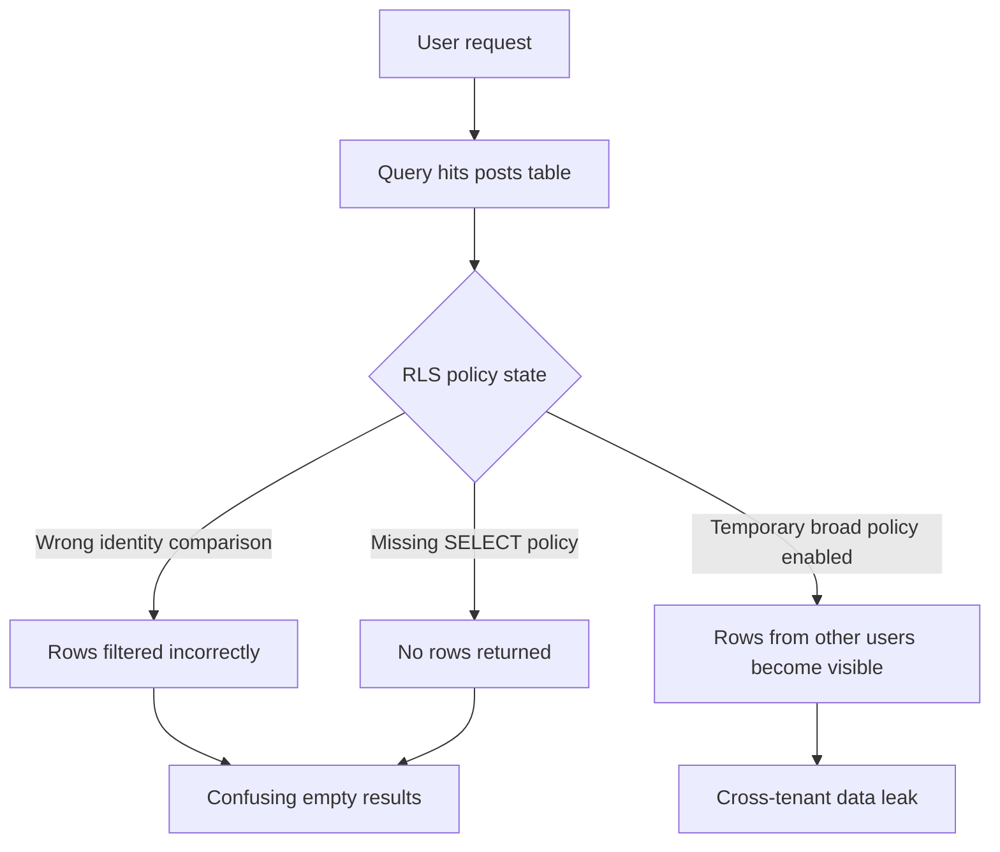

# RLS Leak Flow

## Meaning

This lab demonstrates that RLS problems usually appear in one of two ways:

+ data is unexpectedly invisible

+ data is unexpectedly visible

Both are policy bugs.

The most dangerous case is a broad temporary policy left behind during debugging.