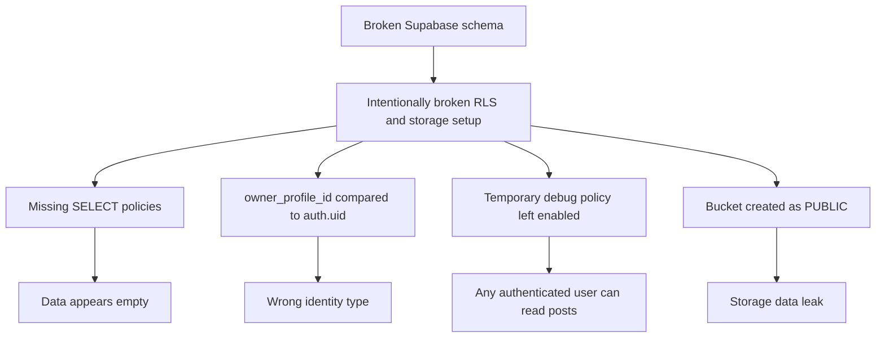
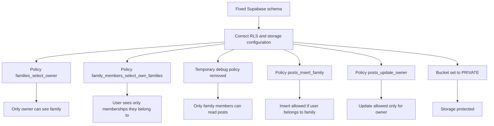
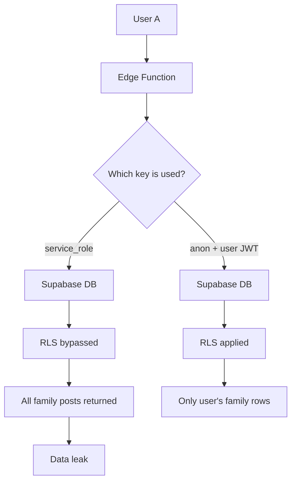

# RLS Broken Lab – Security Overview

## 1. Broken Schema

## 2. Fixed Schema

## 3. Edge Function Security

## Key Point

service_role bypasses RLS completely.

If an Edge Function uses service_role for user-facing queries, the database can return rows outside the user's tenant boundary unless ownership is manually enforced.

Using anon plus forwarded user JWT keeps RLS active.